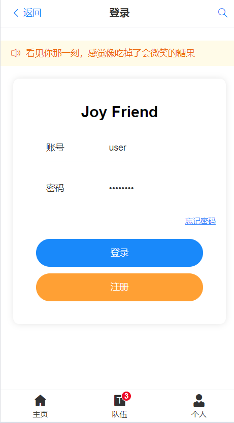
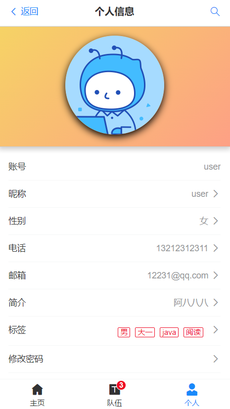
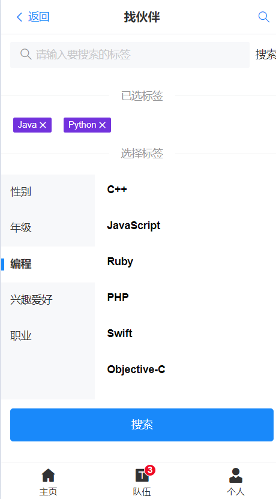
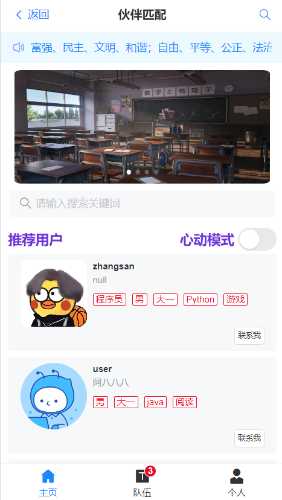
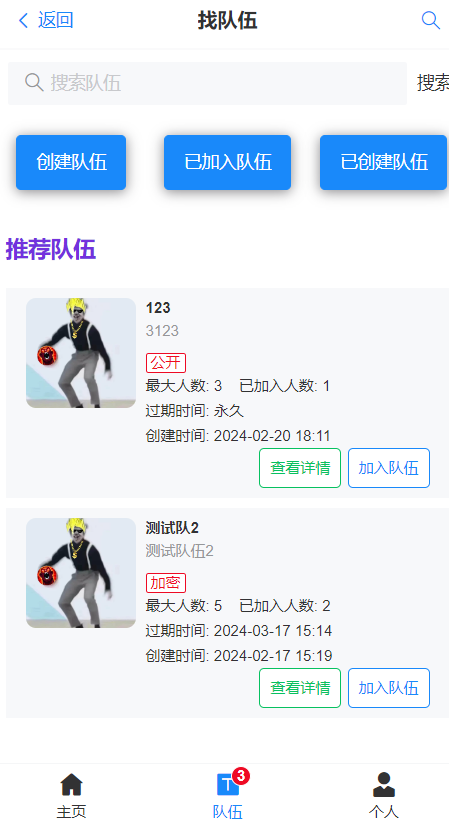
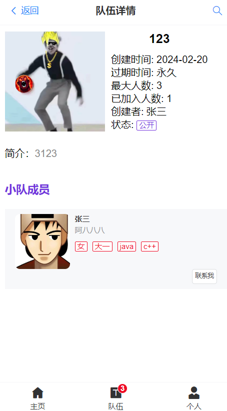

# SpringBoot+Vue伙伴匹配系统

## 技术栈

### 前端

1. Vue 3 开发框架
2. Vant UI
3. Vite 2

### 后端

1. Java 编程语言 + SpringBoot 框架
2. SpringMVC + MyBatis + MyBatis Plus
3. MySQL 数据库
4. Redis 缓存
5. Redisson分布式锁
6. Spring Scheduler定时任务
7. Gson JSON序列化库
8. Swagger + Knife4j 接口文档
9. 最短编辑距离算法

## 页面截图                                                                                                                                                                              
登录

个人信息

标签

主页

队伍

队伍详情

